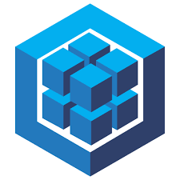

<h2> Hi, I'm igsecu! 👋</h2>

About me

<ul>
  <li>👨‍💻 Backend Developer - NodeJs / Javascript</li>
  <li>🎯 Looking for my first job</li>
  <li>🤝 Sharing full applications APIs</li>
  <li>🔜 Working on a Newspaper API with cron jobs and Paypal Integration</li>
</ul>

Technologies

  
  
  
  
  
  
  
  
  
  
  

Immersing myself

  
  
  
  

You can reach me

My last projects

If you want to sponsor one of my projects 

