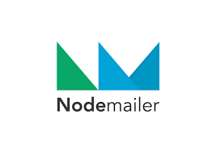
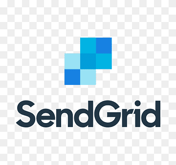
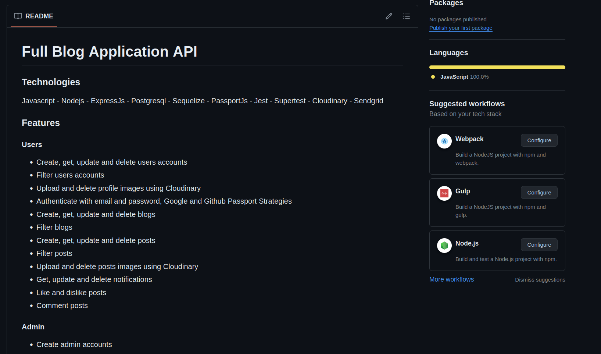
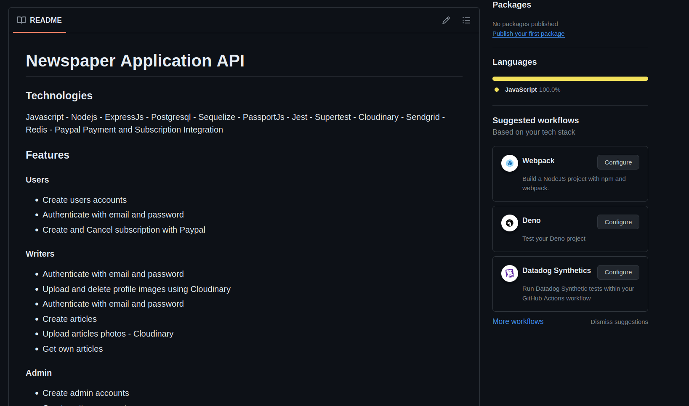

<h2> Hi, I'm igsecu! 👋</h2>

### About me

<ul>
  <li>👨‍💻 Backend Developer - NodeJs / Javascript</li>
  <li>🎯 Looking for my first job</li>
  <li>🤝 Sharing full applications APIs</li>
  <li>🔜 Working on a Newspaper API with cron jobs and Paypal Integration</li>
</ul>

### Technologies

  
  
  
  
  
  
  
  
  
  
  
  
  
  

### Immersing myself

  
  
  

### You can reach me

### My last projects

<table>
<tr>
<td width="50%">
<h3 align="center">Full Blog Application API</h3>

              
</td>
<td width="50%">
<h3 align="center">Newspaper Application API</h3>

              
</td>
</tr>
                                                    
</table>
