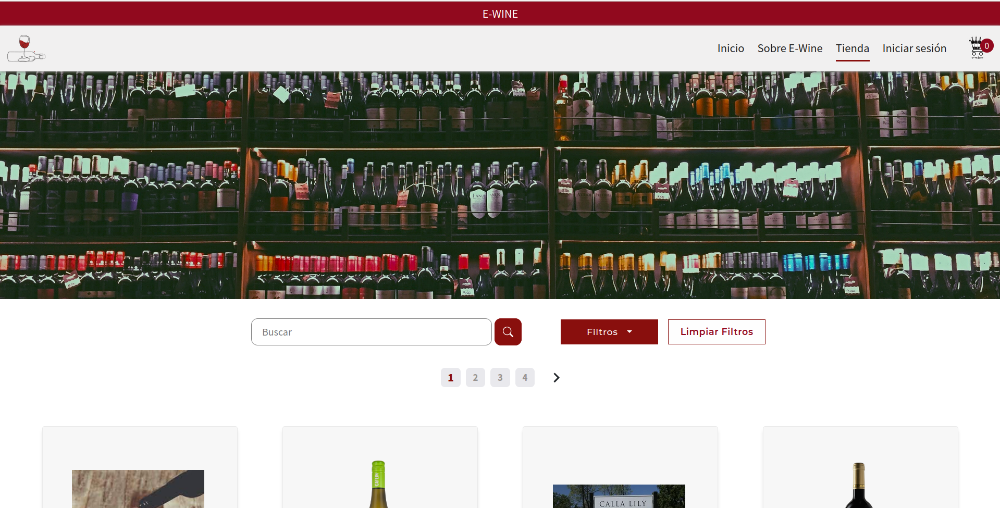
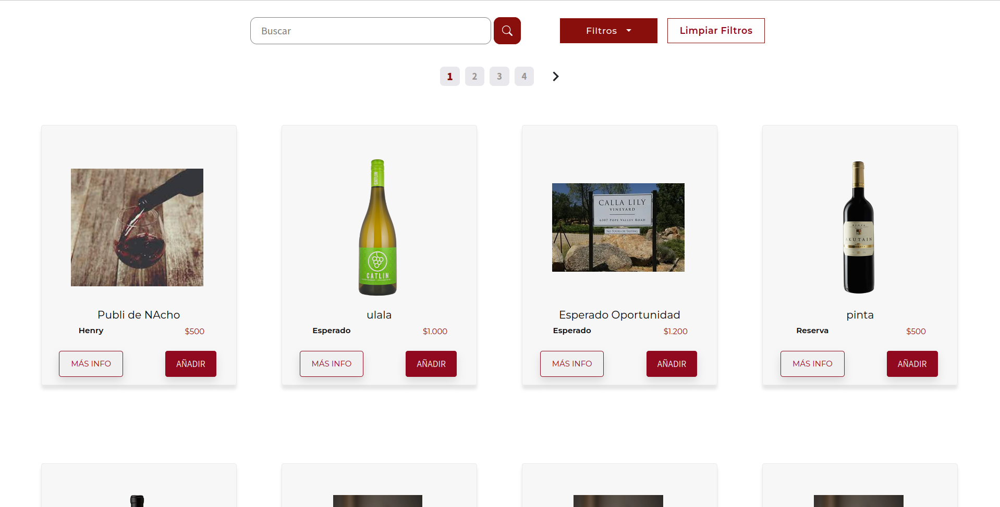
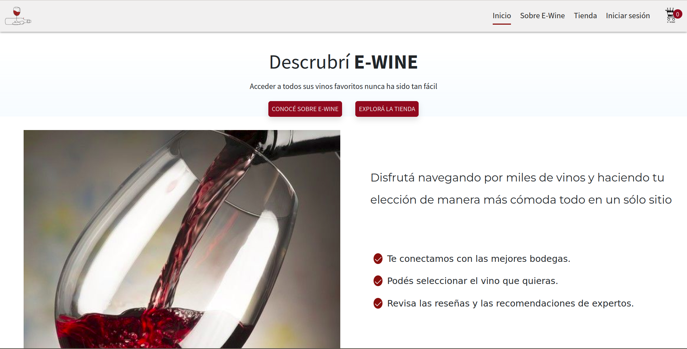
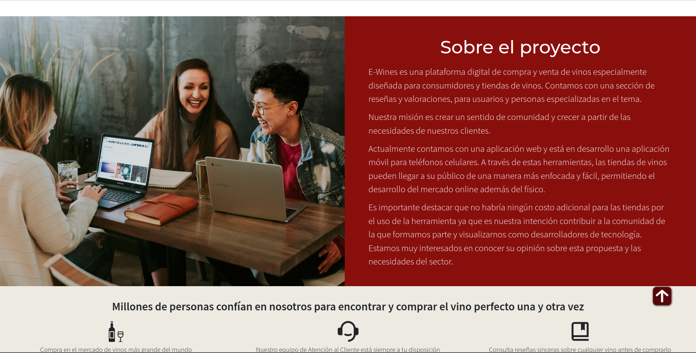
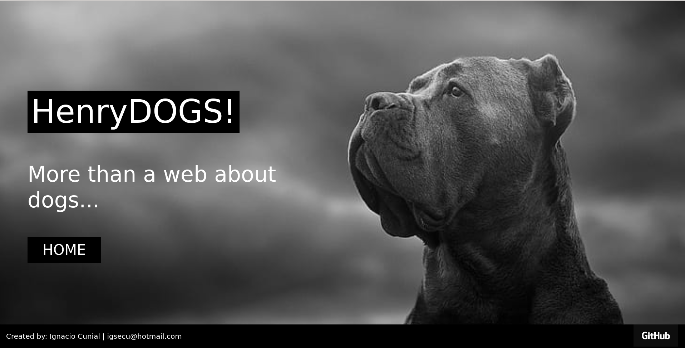
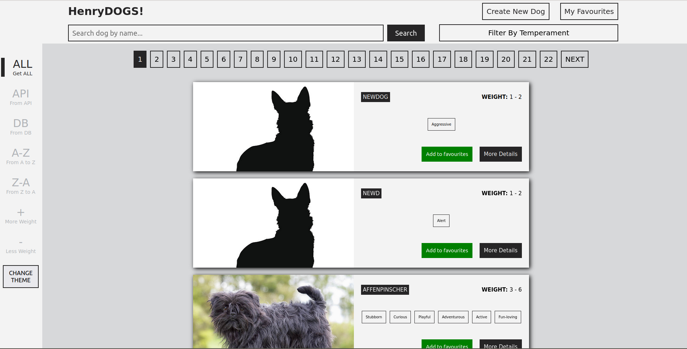
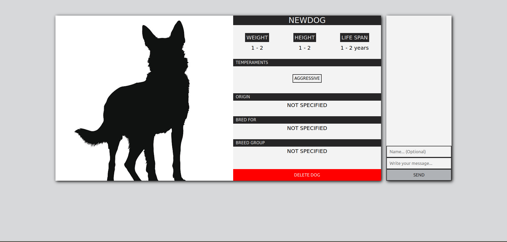
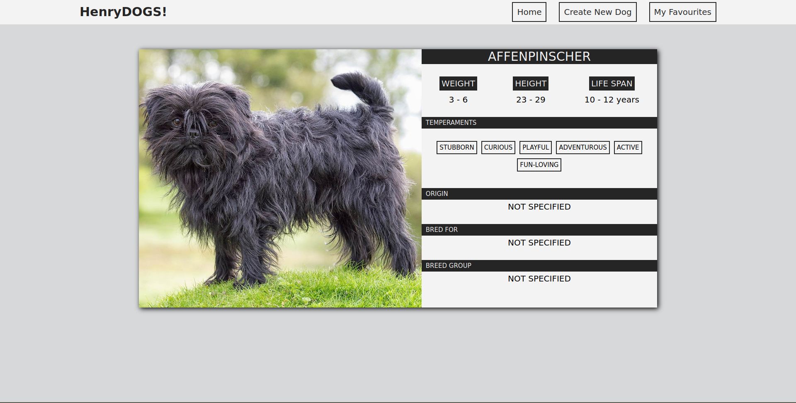

  
  <h1>Ignacio Cunial - Desarrollador FullStack</h1>

  
:heavy_check_mark: FullStack developer con experiencia en el sector audiovisual

  
:heavy_check_mark: Predispuesto a adquirir nuevos conocimientos

  
:heavy_check_mark: Orientado a la resolución de problemas y logro de objetivos, con pensamiento analítico y trabajo en equipo

  
:heavy_check_mark: Autonomía y autodidacta a la hora de adquirir nuevos conocimientos

<h2>:hammer_and_wrench: Tecnologías</h2>

HTML | CSS | Javascript | ReactJs | Redux | NodeJs | Express | Socket.io | Nodemailer | JWT | Passport | Postgres | Sequelize | GIT | Scrum

  &nbsp;
  &nbsp;
  &nbsp;
  &
  &nbsp;
  &nbsp;
   &nbsp;
    &nbsp;
    &nbsp;
     &nbsp;
  
  

<h2>Mis trabajos :point_down:</h2>
<h3>E-Wines</h3>

E-Commerce cuyo objetivo es la conexión entre vinotecas y pequeñas bodegas con futuros clientes

 

 

HTML | CSS | Javascript | ReactJs | Redux | NodeJs | Express | Postgres | Sequelize | Git | Trello | Scrum

 

:heavy_check_mark: Deploy: <a href="https://e-wine-ashen.vercel.app/" target="_blank">E-Wines App</a>

:heavy_check_mark: <a href="https://github.com/icunial/E-Wines-Ecommerce" target="_blank">E-Wines App Repositorio</a>

 
<h3>Henry Dogs</h3>

Single-page application enfocada en las razas de perros de todo el mundo.

 

 

Javascript | HTML | CSS | React | Redux | Node | Sequelize | PostgreSQL

:heavy_check_mark: Deploy: <a href="https://pi-cunial.herokuapp.com/" target="_blank">Henry Dogs App</a>

:heavy_check_mark: <a href="https://github.com/icunial/PI-Henry" target="_blank">Henry Dogs Repositorio</a>

<h2>:mailbox: Contactame</h2>

Email: igsecu@hotmail.com

